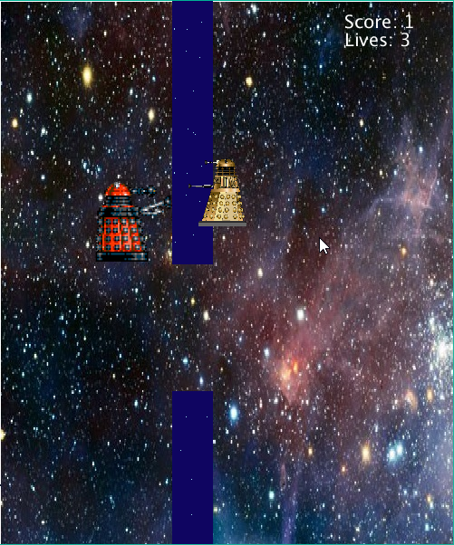
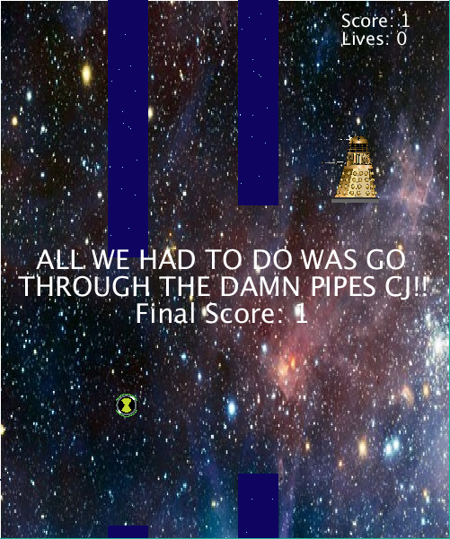

# rebel_dalek_escape
A Java game I made using Processing 3.3 in 2016 as part of my university Coding Bootcamp.

I created a Flappy bird clone essentially based on Doctor Who. Theres a lot of things that I wanted to do that I couldn't including implementing a menu system, 
cos the game just starts as soon as you open it, and you have to close it when you lose.
Also, collectibles. The omnitrix icons are there but they don't do anything.
The opposing daleks are also supposed to be enemies. You can shoot them but they just go back to the right side of the screen.
I got the code for the bars/pipes from online cos I couldn't figure it out myself. The credit is in the code. 

